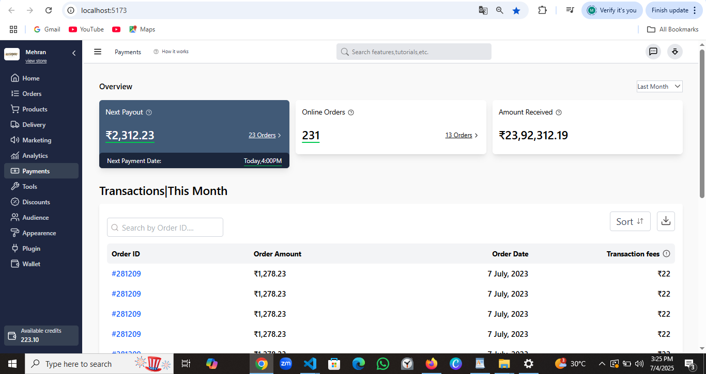

Dukaan-UI-Clone

This project is a meticulously crafted frontend clone of the Dukaan Dashboard UI, built with React.js and styled with Tailwind CSS. It aims to replicate the clean, modern, and intuitive user interface of the original Dukaan platform, offering a highly attractive and responsive design.

✨ Features Dashboard Overview: A comprehensive dashboard displaying key metrics like "Next Payout," "Online Orders," and "Amount Received."

Transactions Table: A detailed table showcasing recent transactions with sort and download options.

Responsive Design: Optimized for seamless viewing and interaction across various devices (desktop, tablet, mobile).

Clean & Modern UI: Leverages the power of Tailwind CSS to deliver a sleek, minimalist, and visually appealing user experience.

Interactive Navigation (Sidebar): A functional sidebar for navigating different sections like Home, Orders, Products, Payments, and more.

🚀 Technologies Used React.js: A powerful JavaScript library for building user interfaces.

Tailwind CSS: A utility-first CSS framework for rapidly building custom designs.

📸 Screenshots Here are some glimpses of the Dukaan UI Clone in action:

Dashboard Overview:.png)

Full Dashboard View with Sidebar:

⚙️ Installation & Setup To get this project up and running on your local machine, follow these steps:

Clone the repository:

git clone https://github.com/Aasif-dar/Dukaan-UI.git cd Dukaan-UI

Install dependencies:

npm install

Start the development server:

npm start

This will typically open the application in your browser at http://localhost:3000 (or a similar port).
